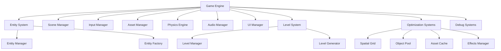
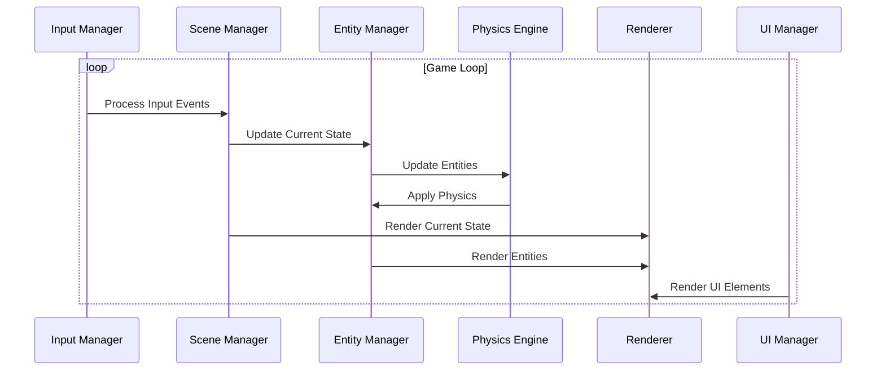

# Game Engine Map

**Version**: v1.0.0  
**Created**: 2025-06-20  
**Last Updated**: 2025-06-20  
**Status**: Draft  
**Owner**: Game Development Team  

## Overview

The Game Engine is the core system of Ink Slime that coordinates all game subsystems and manages the main game loop. It serves as the central hub that connects and orchestrates the various components of the game, including entity management, rendering, input handling, physics, audio, and UI. The engine is responsible for initializing all systems, maintaining the game state, processing the game loop, and ensuring proper cleanup when the game ends.

## Architecture

The Game Engine follows a modular architecture with clear separation of concerns between different subsystems. It implements a component-based entity system and a state-driven game loop.



## Key Components

### Initialization System

The initialization system is responsible for setting up all game subsystems and preparing the game for execution. It performs the following tasks:

- Initializes Pygame and sets up the display
- Creates the game clock for frame rate control
- Initializes the entity system (Entity Manager and Entity Factory)
- Initializes the level system (Level Manager and Level Generator)
- Sets up all managers (Scene, Input, Asset, Physics, Audio, UI)
- Initializes optimization systems (Spatial Grid, Object Pool, Asset Cache, Effects Manager)
- Loads default assets and sounds
- Starts the initial game state (typically the main menu)

```python
def initialize(self, width: int = 800, height: int = 600, title: str = "Octopus Ink Slime"):
    # Initialize Pygame
    # Set up display
    # Initialize clock
    # Initialize Entity System
    # Initialize Level System
    # Initialize all managers
    # Initialize optimization systems
    # Load default sounds
    # Start with the main menu state
```

### Game Loop

The game loop is the heart of the engine, responsible for continuously updating and rendering the game state. It follows a fixed time step pattern and includes:

- Delta time calculation for frame-independent updates
- Event processing
- Input handling
- State updates
- Physics calculations
- Collision detection and resolution
- Rendering
- Debug information display (when enabled)

```python
def run(self):
    while self.running:
        # Calculate delta time
        # Process events
        # Update current scene
        # Update entity manager
        # Update physics
        # Update UI
        # Render scene
        # Render entities
        # Render UI
        # Update display
```

### State Management

The state management system handles different game states (main menu, gameplay, pause, game over) and transitions between them. The engine delegates state-specific logic to the Scene Manager, which:

- Maintains the current active state
- Handles state transitions
- Ensures proper initialization and cleanup of states
- Routes events and updates to the current state

### Entity System

The entity system manages all game objects using a component-based architecture. It consists of:

- Entity Manager: Tracks all entities, updates them, and handles their lifecycle
- Entity Factory: Creates predefined entity types with appropriate components
- Component System: Defines reusable behaviors that can be attached to entities

### Level System

The level system manages level progression, generation, and completion:

- Level Manager: Tracks current level, handles level transitions, and stores level data
- Level Generator: Creates level-specific entities and environments

### Collision System

The collision system detects and resolves interactions between game entities:

- Spatial Grid: Optimizes collision detection by partitioning space
- Collision Detection: Identifies when entities overlap
- Collision Resolution: Handles the effects of collisions (damage, scoring, etc.)

### Debug System

The debug system provides tools for development and troubleshooting:

- FPS display
- Entity count tracking
- Collision area visualization
- Entity boundary display
- Spatial grid visualization
- Performance monitoring

## Data Flow

The data flow in the Game Engine follows a typical game loop pattern:



1. **Input Processing**: The Input Manager processes user input and generates events
2. **State Update**: The Scene Manager updates the current game state
3. **Entity Update**: The Entity Manager updates all active entities
4. **Physics Calculation**: The Physics Engine applies physics to entities
5. **Collision Detection**: The Spatial Grid identifies potential collisions
6. **Rendering**: The rendering system draws the current state, entities, and UI
7. **Display Update**: The display is updated to show the new frame

## API Definitions

### Initialization API

```python
def initialize(width: int = 800, height: int = 600, title: str = "Octopus Ink Slime")
```
Initializes the game engine with the specified screen dimensions and window title.

### Game Loop API

```python
def run()
```
Starts the main game loop. This method blocks until the game is closed.

### Cleanup API

```python
def quit()
```
Cleans up resources and exits the game.

### Entity Management API

```python
# Via entity_manager
def add_entity(entity)
def remove_entity(entity_id)
def get_entity(entity_id)
def get_entities_with_tag(tag)
```

### State Management API

```python
# Via scene_manager
def start(state_name)
def change_state(state_name, *args)
```

## Dependencies

### External Dependencies

- **Pygame**: Used for rendering, input handling, audio, and basic game functionality
- **Python Standard Library**: Used for various utilities and data structures
- **psutil** (optional): Used for performance monitoring

### Internal Dependencies

The Game Engine has dependencies on the following internal systems:

- **Entity System**: For managing game objects
- **Scene Manager**: For handling game states
- **Input Manager**: For processing user input
- **Asset Manager**: For loading and managing game assets
- **Physics Engine**: For handling physics calculations
- **Audio Manager**: For playing sounds and music
- **UI Manager**: For rendering user interface elements
- **Level System**: For managing level progression

## Configuration

The Game Engine can be configured through the following parameters:

- **Screen dimensions**: Width and height of the game window
- **Window title**: Title displayed in the window caption
- **Frame rate**: Target frames per second (default: 60)
- **Debug options**: Various debug visualization toggles

## Performance Considerations

The Game Engine implements several optimization strategies:

- **Spatial Grid**: Reduces collision detection complexity from O(n²) to O(n)
- **Object Pool**: Reuses common objects (like projectiles) to reduce garbage collection
- **Asset Cache**: Prevents redundant loading of assets
- **Entity Activation/Deactivation**: Only updates active entities

## Future Enhancements

Planned enhancements for the Game Engine include:

- **Multi-threading support**: Offload physics calculations to a separate thread
- **Enhanced rendering pipeline**: Support for shaders and post-processing effects
- **Improved debugging tools**: Profiling and visualization tools
- **Scripting support**: Allow for game logic to be defined in scripts

## Appendix

### Glossary

- **Entity**: A game object composed of various components
- **Component**: A reusable module that defines a specific aspect of an entity's behavior
- **Game State**: A specific mode of the game, such as main menu, gameplay, or pause
- **Delta Time**: The time elapsed since the last frame, used for frame-independent updates

### Change History

| Version | Date | Author | Description |
|---------|------|--------|-------------|
| v1.0.0 | 2025-06-20 | Game Development Team | Initial version of the Game Engine Map |