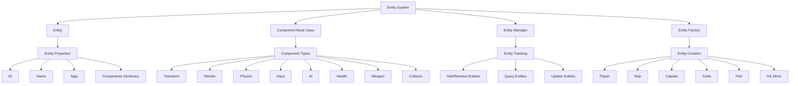
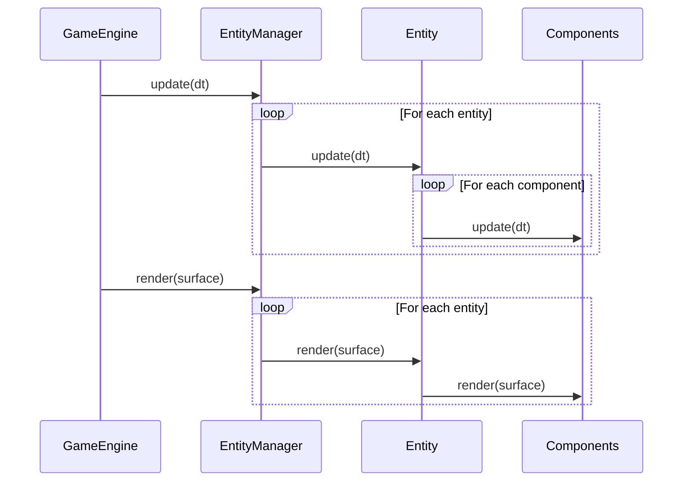

# Entity System Map

**Version**: v1.0.0  
**Created**: 2025-06-20  
**Last Updated**: 2025-06-20  
**Status**: Draft  
**Owner**: Game Development Team  

## Overview

The Entity-Component System (ECS) is a core architectural pattern used in the Ink Slime game that enables flexible and modular game object creation. This pattern separates game objects (entities) from their behaviors and properties (components), allowing for greater code reuse, easier maintenance, and more efficient runtime performance.

In this architecture:
- **Entities** are containers that represent game objects like the player, enemies, projectiles, etc.
- **Components** are reusable modules that define specific behaviors or properties (e.g., position, rendering, physics)
- **Systems** (primarily the Entity Manager) process entities with specific component combinations

This approach allows for dynamic composition of game objects by attaching different combinations of components to entities, rather than relying on deep inheritance hierarchies.

## Architecture

The Entity System follows a composition-based architecture where entities are containers for components, and the Entity Manager tracks and updates all entities in the game.



## Key Components

### Entity Class

The Entity class is the foundation of the entity-component system. It serves as a container for components and represents a game object.

Key features:
- Unique identifier (entity_id) for tracking and referencing
- Human-readable name for debugging
- Component management (add, remove, get components)
- Tag system for categorization (e.g., "enemy", "player", "projectile")
- Active state tracking
- Update and render methods that delegate to components
- Lifecycle management (creation, destruction)

```python
class Entity:
    def __init__(self, entity_id: Optional[str] = None, name: str = "Entity"):
        self.entity_id = entity_id or str(uuid.uuid4())
        self.name = name
        self.components: Dict[str, 'Component'] = {}
        self.tags: List[str] = []
        self.active = True
        self.marked_for_destruction = False
        
    def add_component(self, component: 'Component') -> 'Component':
        # Add a component to the entity
        
    def get_component(self, component_type: str) -> Optional['Component']:
        # Get a component by type
        
    def has_component(self, component_type: str) -> bool:
        # Check if the entity has a component
        
    def remove_component(self, component_type: str) -> Optional['Component']:
        # Remove a component from the entity
        
    def add_tag(self, tag: str) -> None:
        # Add a tag to the entity
        
    def has_tag(self, tag: str) -> bool:
        # Check if the entity has a tag
        
    def remove_tag(self, tag: str) -> None:
        # Remove a tag from the entity
        
    def update(self, dt: float) -> None:
        # Update all components
        
    def render(self, surface) -> None:
        # Render the entity
        
    def destroy(self) -> None:
        # Mark the entity for destruction
        
    def set_active(self, active: bool) -> None:
        # Set the active state of the entity
```

### Component Base Class

The Component base class defines the interface for all components in the system. Components encapsulate specific behaviors or properties that can be attached to entities.

Key features:
- Component type identifier
- Reference to the parent entity
- Enabled state tracking
- Abstract update method for component-specific logic
- Lifecycle hooks (on_add, on_remove)

```python
class Component(ABC):
    def __init__(self, component_type: str):
        self.component_type = component_type
        self.entity: 'Entity' = None
        self.enabled = True
        
    @abstractmethod
    def update(self, dt: float) -> None:
        # Update the component (must be implemented by subclasses)
        pass
    
    def on_add(self) -> None:
        # Called when the component is added to an entity
        pass
    
    def on_remove(self) -> None:
        # Called when the component is removed from an entity
        pass
    
    def set_enabled(self, enabled: bool) -> None:
        # Enable or disable the component
        self.enabled = enabled
```

### Entity Manager

The EntityManager is responsible for tracking and updating all entities in the game. It serves as the central registry for entities and provides methods to query entities based on tags or components.

Key features:
- Entity tracking (add, remove, get entities)
- Deferred entity addition and removal (to avoid modifying collections during iteration)
- Tag-based indexing for efficient entity queries
- Component-based entity queries
- Update and render methods for all entities
- Entity lifecycle management

```python
class EntityManager:
    def __init__(self):
        self.entities: Dict[str, Entity] = {}
        self.entities_to_add: List[Entity] = []
        self.entities_to_remove: List[str] = []
        self.tag_index: Dict[str, Set[str]] = {}  # tag -> set of entity_ids
        
    def add_entity(self, entity: Entity) -> None:
        # Add an entity to the manager
        
    def remove_entity(self, entity_id: str) -> None:
        # Remove an entity from the manager
        
    def get_entity(self, entity_id: str) -> Optional[Entity]:
        # Get an entity by ID
        
    def get_entities_with_tag(self, tag: str) -> List[Entity]:
        # Get all entities with a specific tag
        
    def get_entities_with_component(self, component_type: str) -> List[Entity]:
        # Get all entities that have a specific component type
        
    def get_entities_with_tags_and_components(self, tags: List[str] = None, 
                                             components: List[str] = None) -> List[Entity]:
        # Get all entities that have all specified tags and components
        
    def update(self, dt: float) -> None:
        # Update all entities
        
    def render(self, surface) -> None:
        # Render all entities
        
    def clear(self) -> None:
        # Remove all entities from the manager
```

### Entity Factory

The EntityFactory is a singleton class that provides methods to create different types of game entities with their appropriate components pre-configured. This ensures consistent entity creation throughout the game.

Key features:
- Singleton pattern for global access
- Reference to the EntityManager for automatic entity registration
- Factory methods for creating different entity types (player, enemies, projectiles)
- Configurable entity creation with parameters

```python
class EntityFactory:
    _instance = None
    
    def __new__(cls):
        # Ensure only one instance exists (Singleton pattern)
        
    def __init__(self):
        # Initialize the EntityFactory
        
    def set_entity_manager(self, entity_manager: EntityManager) -> None:
        # Set the entity manager that will track created entities
        
    def create_player(self, x: float, y: float) -> Entity:
        # Create a player entity
        
    def create_ship(self, x: float, y: float, ship_type: str = "small", direction: int = 1,
                   speed: float = None, health: float = None) -> Entity:
        # Create a ship entity
        
    def create_captain(self, x: float, y: float) -> Entity:
        # Create a captain entity
        
    def create_turtle(self, x: float, y: float, movement_pattern: str = "stationary",
                     speed: float = None) -> Entity:
        # Create a turtle entity
        
    def create_fish(self, x: float, y: float, fish_type: str = "normal", 
                   value_multiplier: float = 1.0) -> Entity:
        # Create a fish entity
        
    def create_ink_slime(self, x: float, y: float, direction: pygame.math.Vector2,
                        color: str = "dark_blue") -> Entity:
        # Create an ink slime projectile entity
        
    def create_enemy_projectile(self, x: float, y: float, 
                               direction: pygame.math.Vector2) -> Entity:
        # Create an enemy projectile entity
```

## Data Flow

The data flow in the Entity System follows a component-based update pattern:



1. **Entity Creation**: Entities are created either directly or through the EntityFactory
2. **Component Attachment**: Components are added to entities to define their behavior
3. **Entity Registration**: Entities are registered with the EntityManager
4. **Update Cycle**: During each frame, the EntityManager updates all active entities
5. **Component Updates**: Each entity delegates updates to its components
6. **Render Cycle**: After updates, entities are rendered based on their render components
7. **Entity Destruction**: Entities marked for destruction are removed at the end of the update cycle

## API Definitions

### Entity API

```python
# Entity Creation
entity = Entity(entity_id=None, name="Entity")

# Component Management
component = entity.add_component(component)
component = entity.get_component(component_type)
has_component = entity.has_component(component_type)
component = entity.remove_component(component_type)

# Tag Management
entity.add_tag(tag)
has_tag = entity.has_tag(tag)
entity.remove_tag(tag)

# Lifecycle Management
entity.update(dt)
entity.render(surface)
entity.destroy()
entity.set_active(active)
```

### Component API

```python
# Component Creation (abstract, must be subclassed)
class CustomComponent(Component):
    def __init__(self):
        super().__init__("custom_type")
        
    def update(self, dt):
        # Custom update logic
        
    def on_add(self):
        # Custom initialization
        
    def on_remove(self):
        # Custom cleanup

# Component Usage
component.set_enabled(enabled)
```

### Entity Manager API

```python
# Entity Management
entity_manager.add_entity(entity)
entity_manager.remove_entity(entity_id)
entity = entity_manager.get_entity(entity_id)

# Entity Queries
entities = entity_manager.get_entities_with_tag(tag)
entities = entity_manager.get_entities_with_component(component_type)
entities = entity_manager.get_entities_with_tags_and_components(tags, components)

# System Operations
entity_manager.update(dt)
entity_manager.render(surface)
entity_manager.clear()
count = entity_manager.get_entity_count()
count = entity_manager.get_active_entity_count()
```

### Entity Factory API

```python
# Factory Access (Singleton)
factory = EntityFactory()

# Entity Manager Setup
factory.set_entity_manager(entity_manager)

# Entity Creation
player = factory.create_player(x, y)
ship = factory.create_ship(x, y, ship_type, direction, speed, health)
captain = factory.create_captain(x, y)
turtle = factory.create_turtle(x, y, movement_pattern, speed)
fish = factory.create_fish(x, y, fish_type, value_multiplier)
ink_slime = factory.create_ink_slime(x, y, direction, color)
enemy_projectile = factory.create_enemy_projectile(x, y, direction)
```

## Examples of Common Entity Types

### Player Entity

The player entity represents the octopus character controlled by the user. It includes components for:

- Transform (position, rotation, scale)
- Custom Render (octopus with arms visualization)
- Physics (movement, friction)
- Input (player control)
- Weapon (ink slime shooting with multiple arms)
- Collision (interaction with other entities)
- Health (player life management)

```python
class Player(Entity):
    def __init__(self, x: float = 0, y: float = 0):
        super().__init__(name="Player_Octopus")
        self.add_tag("player")
        
        # Configure all components
        self._setup_transform(x, y)
        self._setup_render()
        self._setup_physics()
        self._setup_input()
        self._setup_weapon()
        self._setup_collision()
        self._setup_health()
```

### Enemy Entities

Enemy entities include ships, captains, turtles, and fish. Each has a specific set of components:

#### Ship Entity
- Transform, Render, Physics components
- AI component for movement patterns
- Health component for damage tracking
- Collision component for interaction
- ShipInkLoad component for special mechanics

#### Captain Entity
- Transform, Render, Physics components
- AI component with "aggressive" behavior
- Health component with higher health values
- Weapon component for shooting at the player
- Collision component for interaction

#### Turtle Entity
- Transform, Render, Physics components
- AI component with configurable movement patterns
- Health component
- Collision component

#### Fish Entity
- Transform, Render, Physics components
- Simple movement patterns
- Point value for scoring

### Projectile Entities

Projectile entities include ink slime (player projectiles) and enemy projectiles:

#### Ink Slime Entity
- Transform component for position and direction
- Render component with color-specific appearance
- Physics component for movement
- Collision component for hitting enemies
- InkSlime component for special effects

#### Enemy Projectile Entity
- Transform component for position and direction
- Render component (cannonball appearance)
- Physics component with constant velocity
- Collision component for hitting the player

## Appendix

### Glossary

- **Entity**: A game object composed of various components
- **Component**: A reusable module that defines a specific aspect of an entity's behavior
- **Entity Manager**: System responsible for tracking and updating all entities
- **Entity Factory**: System responsible for creating predefined entity types
- **Tag**: A string identifier used to categorize entities
- **Component Type**: A string identifier used to categorize components

### Change History

| Version | Date | Author | Description |
|---------|------|--------|-------------|
| v1.0.0 | 2025-06-20 | Game Development Team | Initial version of the Entity System Map |