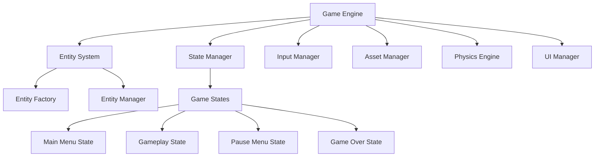
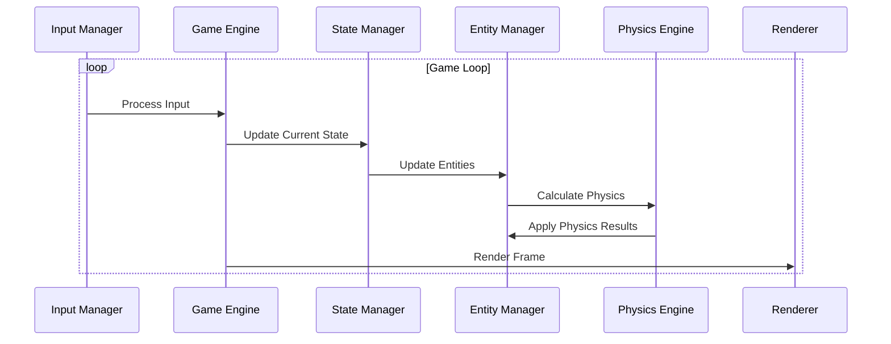

# Ink Slime: Map of Maps

**Version**: v1.0.0  
**Created**: 2025-06-20  
**Last Updated**: 2025-06-20  
**Status**: Draft  
**Owner**: Game Development Team  

## Overview

This document serves as the central directory for all Ink Slime game documentation, including software development maps and AI agent guide files. It provides a structured overview of the game's architecture, components, and systems to help developers, designers, and AI agents understand and navigate the codebase.

## Architecture/Design

The Ink Slime game is built using a component-based entity system with a state-driven game loop. The architecture follows a modular design pattern, separating game logic, rendering, input handling, and state management.

## Key Components

### Game Engine

The core game engine coordinates all subsystems and manages the main game loop. It handles initialization, updates, rendering, and cleanup of game resources.

**Map File**: [Game Engine Map](../docs/engine/game-engine.map.md)

### Entity System

The entity system manages game objects using a component-based architecture. Entities are composed of various components that define their behavior, appearance, and properties.

**Map File**: [Entity System Map](../docs/entities/entity-system.map.md)

### State Management

The state management system handles different game states (main menu, gameplay, pause, game over) and transitions between them.

**Map File**: [State Management Map](../docs/states/state-management.map.md)

### Level System

The level system manages level generation, progression, and completion criteria.

**Map File**: [Level System Map](../docs/levels/level-system.map.md)

### UI System

The UI system handles user interface elements, including menus, buttons, labels, and HUD elements.

**Map File**: [UI System Map](../docs/ui/ui-system.map.md)

## Game Mechanics

### Player Controls

Documentation on player movement, shooting mechanics, and special abilities.

**Map File**: [Player Controls Map](../docs/mechanics/player-controls.map.md)

### Enemy Behavior

Documentation on enemy types, behavior patterns, and AI.

**Map File**: [Enemy Behavior Map](../docs/mechanics/enemy-behavior.map.md)

### Ink Mechanics

Documentation on the ink system, including colors, effects, and interactions.

**Map File**: [Ink Mechanics Map](../docs/mechanics/ink-mechanics.map.md)

## AI Agent Guides

### Game Engine Navigation

Guide for AI agents to understand and navigate the game engine codebase.

**Map File**: [Game Engine Navigation Guide](../docs/ai-guides/engine-navigation.map.md)

### Entity Component System

Guide for AI agents to understand the entity component system and how to modify or extend it.

**Map File**: [Entity Component System Guide](../docs/ai-guides/entity-component-system.map.md)

### State Management

Guide for AI agents to understand the state management system and how to implement new states or modify existing ones.

**Map File**: [State Management Guide](../docs/ai-guides/state-management.map.md)

### UI System

Guide for AI agents to understand the UI system and how to create or modify UI elements.

**Map File**: [UI System Guide](../docs/ai-guides/ui-system.map.md)

## Data Flow

The data flow in Ink Slime follows a typical game loop pattern, with input processing, state updates, physics calculations, and rendering.

## API/Interface Definitions

### Game Engine API

The Game Engine provides APIs for initializing, running, and shutting down the game.

**Map File**: [Game Engine API](../docs/api/game-engine-api.map.md)

### Entity System API

The Entity System provides APIs for creating, managing, and destroying game entities.

**Map File**: [Entity System API](../docs/api/entity-system-api.map.md)

### State Management API

The State Management system provides APIs for registering, changing, and managing game states.

**Map File**: [State Management API](../docs/api/state-management-api.map.md)

## Dependencies

### External Dependencies

- Pygame: Used for rendering, input handling, and audio
- Python Standard Library: Used for various utilities and data structures

### Internal Dependencies

- Entity System depends on Component System
- State Manager depends on Game Engine
- UI Manager depends on Asset Manager

## Configuration

Game configuration is managed through the `config.ini` file, which includes settings for display, audio, controls, and gameplay.

**Map File**: [Configuration Guide](../docs/config/configuration.map.md)

## Testing Strategy

The testing strategy includes unit tests for individual components, integration tests for subsystems, and end-to-end tests for gameplay scenarios.

**Map File**: [Testing Strategy](../docs/testing/testing-strategy.map.md)

## Future Enhancements

Planned enhancements include additional levels, enemy types, power-ups, and multiplayer support.

**Map File**: [Future Enhancements](../docs/roadmap/future-enhancements.map.md)

## Related Documentation

- [Game Design Document](../game_design_document.md)
- [README](../README.md)
- [Setup Guide](../setup.md)

## Appendix

### Glossary

- **Entity**: A game object composed of various components
- **Component**: A reusable module that defines a specific aspect of an entity's behavior or properties
- **State**: A specific mode of the game, such as main menu, gameplay, or pause
- **Ink**: The primary gameplay mechanic, used by the player to defeat enemies

### Change History

| Version | Date | Author | Description |
|---------|------|--------|-------------|
| v1.0.0 | 2025-06-20 | Game Development Team | Initial version of the Map of Maps |