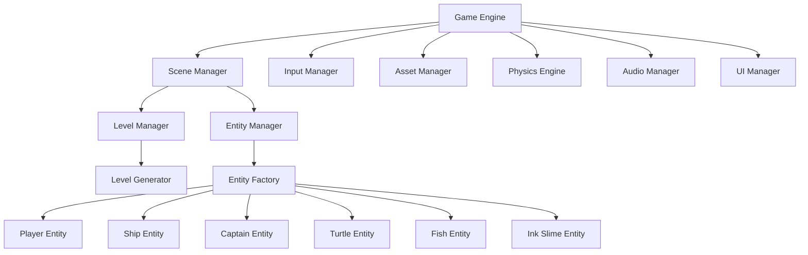
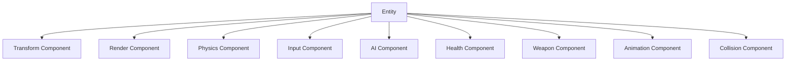
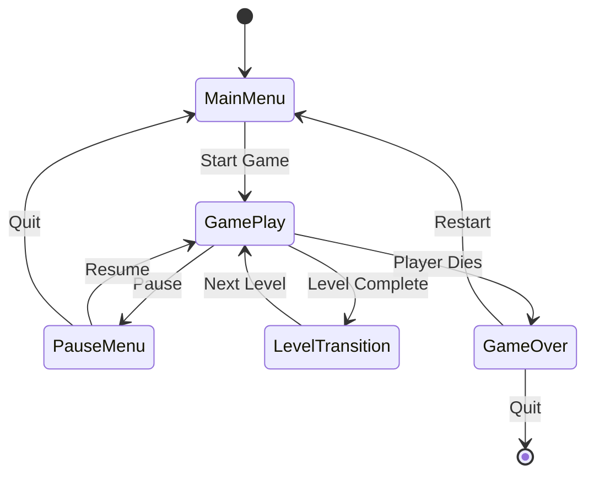
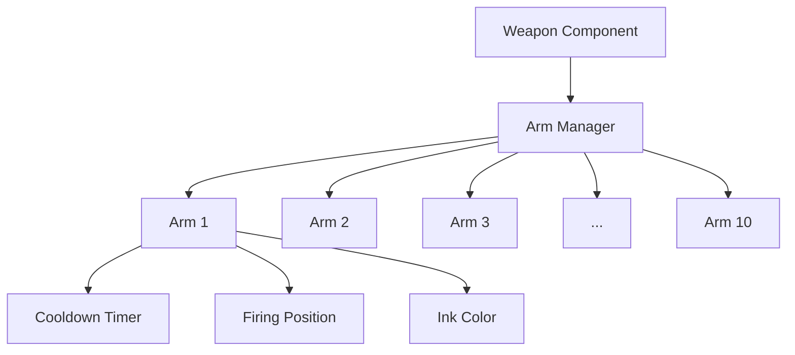
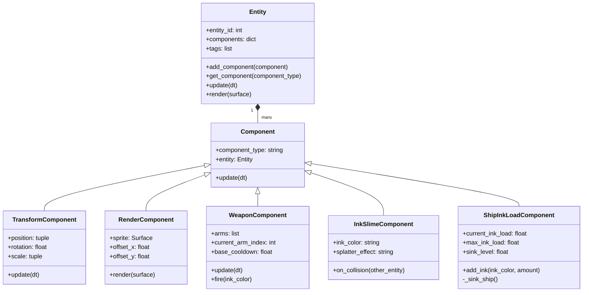
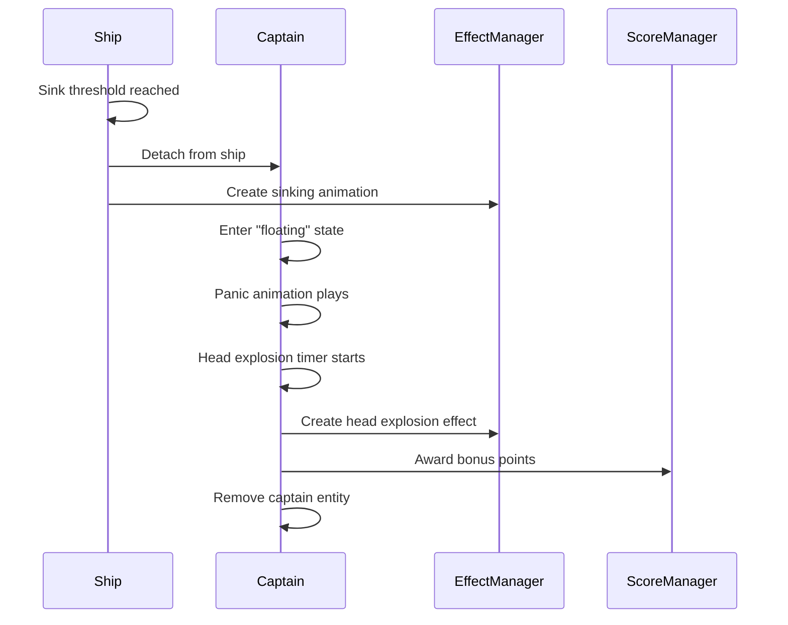

# Octopus Ink Slime Game - Architecture Design Document

## Table of Contents
1. [Overall Architecture](#1-overall-architecture)
2. [Component-Based Entity System](#2-component-based-entity-system)
3. [Entity Types and Their Components](#3-entity-types-and-their-components)
4. [Game State Management](#4-game-state-management)
5. [Level Design and Progression](#5-level-design-and-progression)
6. [Technical Implementation](#6-technical-implementation)
7. [Implementation Considerations](#7-implementation-considerations)
8. [Core Class Definitions](#8-core-class-definitions)
9. [Implementation Roadmap](#9-implementation-roadmap)
10. [Octopus Weapon System](#10-octopus-weapon-system)
11. [Ink Slime Physics and Effects](#11-ink-slime-physics-and-effects)
12. [Visual Effects System](#12-visual-effects-system)
13. [Level Design with Progressive Ink Colors](#13-level-design-with-progressive-ink-colors)
14. [Updated Class Diagram](#14-updated-class-diagram)
15. [Captain Behavior and Death Effects](#15-captain-behavior-and-death-effects)

## 1. Overall Architecture

The game will follow a component-based architecture pattern, which is widely used in modern game development. This approach will provide flexibility, reusability, and scalability as the game evolves.



### Core Systems

1. **Game Engine**: The central system that coordinates all other systems and manages the game loop.
2. **Scene Manager**: Handles different game scenes (main menu, gameplay, level transitions, game over).
3. **Input Manager**: Processes player input (arrow keys for movement, spacebar for shooting).
4. **Asset Manager**: Loads and manages game assets (images, sounds, animations).
5. **Physics Engine**: Handles collision detection and response.
6. **Audio Manager**: Manages sound effects and background music.
7. **UI Manager**: Handles game UI elements (score display, level indicators, health bars).

### Game-Specific Systems

1. **Level Manager**: Manages level progression and difficulty scaling.
2. **Level Generator**: Creates randomized level layouts based on difficulty parameters.
3. **Entity Manager**: Tracks and updates all game entities.
4. **Entity Factory**: Creates different types of game entities.

## 2. Component-Based Entity System

Each game entity will be composed of various components that define its behavior and properties:



### Core Components

1. **Transform Component**: Manages position, rotation, and scale.
2. **Render Component**: Handles rendering the entity on screen.
3. **Physics Component**: Manages velocity, acceleration, and physics interactions.
4. **Input Component**: Processes player input for controllable entities.
5. **AI Component**: Controls behavior for non-player entities.
6. **Health Component**: Tracks entity health/damage state.
7. **Weapon Component**: Manages shooting mechanics and ammunition.
8. **Animation Component**: Handles sprite animations.
9. **Collision Component**: Defines collision boundaries and handles collision events.

## 3. Entity Types and Their Components

### Player (Octopus)
- Transform Component
- Render Component
- Physics Component
- Input Component
- Health Component
- Weapon Component (manages the 10 arms and ink slime shots)
- Animation Component
- Collision Component

### Ship
- Transform Component
- Render Component
- Physics Component
- AI Component
- Health Component
- Animation Component
- Collision Component
- InkLoadComponent (tracks how much ink the ship has taken on)

### Captain
- Transform Component
- Render Component
- Physics Component
- AI Component
- Health Component
- Animation Component
- Collision Component
- CaptainComponent (manages captain-specific behavior)

### Turtle (Obstacle)
- Transform Component
- Render Component
- Physics Component
- AI Component
- Shield Component (special component for blocking ink shots)
- Animation Component
- Collision Component

### Fish (Bonus Target)
- Transform Component
- Render Component
- Physics Component
- AI Component
- Animation Component
- Collision Component

### Ink Slime Projectile
- Transform Component
- Render Component
- Physics Component
- Animation Component
- Collision Component
- Lifetime Component (for managing projectile lifespan)
- InkSlimeComponent (manages ink-specific properties)

## 4. Game State Management

The game will use a state machine pattern to manage different game states:



### Game States
1. **MainMenu**: The starting state showing the game title, play button, and options.
2. **GamePlay**: The active gameplay state where the player controls the octopus.
3. **PauseMenu**: Pauses the game and shows options to resume or quit.
4. **LevelTransition**: Shows level completion stats and prepares for the next level.
5. **GameOver**: Shows game over screen with final score and restart option.

## 5. Level Design and Progression

### Level Structure
Each level will be defined by a set of parameters that control difficulty and gameplay elements:

```python
{
    "level_id": 1,
    "ship_speed": 100,  # pixels per second
    "ship_count": 1,
    "turtle_count": 3,
    "fish_spawn_rate": 0.2,  # probability per second
    "ink_color": "dark_blue",
    "ink_amount": 100,
    "background": "shallow_water",
    "obstacles": ["seaweed", "rocks"],
    "time_limit": 120  # seconds
}
```

### Level Progression
1. **Level 1**: Slow ship, mostly open board, 100 dark ink slime shots
   - Ship Speed: Slow
   - Obstacles: Few
   - Ink Color: Dark Blue
   - Difficulty: Easy

2. **Level 2**: Faster ship, different ink color
   - Ship Speed: Medium
   - Obstacles: More
   - Ink Color: Purple
   - Difficulty: Medium-Easy

3. **Level 3**: Even faster ship, different ink color
   - Ship Speed: Medium-Fast
   - Obstacles: Many
   - Ink Color: Green
   - Difficulty: Medium

4. **Level 4**: Fast ship, different ink color
   - Ship Speed: Fast
   - Obstacles: Many with movement
   - Ink Color: Red
   - Difficulty: Medium-Hard

5. **Level 5**: Fastest ship, rainbow ink slime
   - Ship Speed: Very Fast
   - Obstacles: Many with complex movement
   - Ink Color: Rainbow (special effects)
   - Difficulty: Hard

## 6. Technical Implementation

### Recommended Libraries
1. **Pygame**: Main game development library
   - Handles rendering, input, sound, and basic physics
   - Well-documented and beginner-friendly

2. **Pymunk** (optional): Physics engine that can be integrated with Pygame
   - Provides more advanced physics if needed

3. **Pygame_gui**: UI components for menus and HUD elements

### Project Structure

```
ink-slime/
├── assets/
│   ├── images/
│   ├── sounds/
│   └── fonts/
├── src/
│   ├── engine/
│   │   ├── __init__.py
│   │   ├── game_engine.py
│   │   ├── scene_manager.py
│   │   ├── input_manager.py
│   │   ├── asset_manager.py
│   │   ├── physics_engine.py
│   │   ├── audio_manager.py
│   │   └── ui_manager.py
│   ├── components/
│   │   ├── __init__.py
│   │   ├── component.py
│   │   ├── transform_component.py
│   │   ├── render_component.py
│   │   ├── physics_component.py
│   │   ├── input_component.py
│   │   ├── ai_component.py
│   │   ├── health_component.py
│   │   ├── weapon_component.py
│   │   ├── animation_component.py
│   │   └── collision_component.py
│   ├── entities/
│   │   ├── __init__.py
│   │   ├── entity.py
│   │   ├── entity_manager.py
│   │   ├── entity_factory.py
│   │   ├── player.py
│   │   ├── ship.py
│   │   ├── captain.py
│   │   ├── turtle.py
│   │   ├── fish.py
│   │   └── ink_slime.py
│   ├── levels/
│   │   ├── __init__.py
│   │   ├── level_manager.py
│   │   ├── level_generator.py
│   │   └── level_data.py
│   ├── states/
│   │   ├── __init__.py
│   │   ├── game_state.py
│   │   ├── main_menu_state.py
│   │   ├── gameplay_state.py
│   │   ├── pause_menu_state.py
│   │   ├── level_transition_state.py
│   │   └── game_over_state.py
│   └── utils/
│       ├── __init__.py
│       ├── constants.py
│       └── helpers.py
├── main.py
├── requirements.txt
└── README.md
```

## 7. Implementation Considerations

### Performance Optimization
1. **Object Pooling**: Reuse ink slime projectiles instead of creating/destroying them
2. **Spatial Partitioning**: Use grid-based collision detection for better performance
3. **Asset Management**: Load assets once and reuse them throughout the game

### Extensibility
1. **Data-Driven Design**: Store level configurations in JSON or YAML files
2. **Plugin System**: Allow for easy addition of new entity types and components
3. **Event System**: Use an event-driven approach for loose coupling between systems

### Saving/Loading
1. **Game Progress**: Save player progress (completed levels, high scores)
2. **Game State**: Allow pausing and resuming the game

## 8. Core Class Definitions

Here are some key class definitions to illustrate the architecture:

### Entity Base Class

```python
class Entity:
    def __init__(self, entity_id):
        self.entity_id = entity_id
        self.components = {}
        self.tags = []
        
    def add_component(self, component):
        self.components[component.component_type] = component
        component.entity = self
        
    def get_component(self, component_type):
        return self.components.get(component_type)
        
    def update(self, dt):
        for component in self.components.values():
            component.update(dt)
            
    def render(self, surface):
        render_component = self.get_component("render")
        if render_component:
            render_component.render(surface)
```

### Component Base Class

```python
class Component:
    def __init__(self, component_type):
        self.component_type = component_type
        self.entity = None
        
    def update(self, dt):
        pass
```

### Game Engine

```python
class GameEngine:
    def __init__(self):
        self.running = False
        self.scene_manager = SceneManager()
        self.input_manager = InputManager()
        self.asset_manager = AssetManager()
        self.physics_engine = PhysicsEngine()
        self.audio_manager = AudioManager()
        self.ui_manager = UIManager()
        self.clock = pygame.time.Clock()
        
    def initialize(self):
        pygame.init()
        # Initialize all managers
        
    def run(self):
        self.running = True
        while self.running:
            dt = self.clock.tick(60) / 1000.0  # Convert to seconds
            
            # Process input
            events = pygame.event.get()
            self.input_manager.process_input(events)
            
            # Update current scene
            self.scene_manager.update(dt)
            
            # Update physics
            self.physics_engine.update(dt)
            
            # Render
            self.scene_manager.render()
            
            # Update display
            pygame.display.flip()
            
    def quit(self):
        self.running = False
        pygame.quit()
```

## 9. Implementation Roadmap

1. **Phase 1: Core Engine Setup**
   - Set up Pygame and basic window
   - Implement game loop
   - Create basic managers (input, asset, scene)

2. **Phase 2: Entity-Component System**
   - Implement base Entity and Component classes
   - Create core components
   - Set up Entity Manager

3. **Phase 3: Player Implementation**
   - Create Octopus entity with components
   - Implement movement and shooting mechanics
   - Set up camera and viewport

4. **Phase 4: Enemy and Obstacle Implementation**
   - Create Ship, Captain, Turtle, and Fish entities
   - Implement AI behaviors
   - Set up collision detection

5. **Phase 5: Level System**
   - Implement Level Manager and Generator
   - Create level progression
   - Balance difficulty

6. **Phase 6: UI and Polish**
   - Create menus and HUD
   - Add sound effects and music
   - Polish animations and visual effects

7. **Phase 7: Testing and Refinement**
   - Playtest and balance gameplay
   - Fix bugs and optimize performance
   - Add final polish

## 10. Octopus Weapon System

### Sequential Arm Firing Mechanism



The octopus's weapon system will be implemented as follows:

1. **Arm Rotation System**:
   - The 10 arms will be positioned around the octopus in a circular pattern
   - Arms will fire in sequence, rotating around the octopus for a continuous firing pattern
   - Each arm will have its own cooldown timer to maintain the firing rhythm

2. **WeaponComponent Implementation**:
```python
class WeaponComponent(Component):
    def __init__(self, arm_count=10, base_cooldown=0.5):
        super().__init__("weapon")
        self.arms = []
        self.current_arm_index = 0
        self.base_cooldown = base_cooldown
        
        # Initialize arms
        for i in range(arm_count):
            angle = (i / arm_count) * 2 * math.pi  # Distribute arms evenly
            self.arms.append({
                "angle": angle,
                "cooldown": 0,
                "position": (math.cos(angle), math.sin(angle))
            })
    
    def update(self, dt):
        # Update cooldowns
        for arm in self.arms:
            if arm["cooldown"] > 0:
                arm["cooldown"] -= dt
        
        # Find next available arm if current one is on cooldown
        if self.arms[self.current_arm_index]["cooldown"] > 0:
            self.current_arm_index = (self.current_arm_index + 1) % len(self.arms)
    
    def fire(self, ink_color):
        arm = self.arms[self.current_arm_index]
        if arm["cooldown"] <= 0:
            # Get entity position from transform component
            transform = self.entity.get_component("transform")
            position = transform.position
            
            # Calculate firing position based on arm angle and entity position
            firing_position = (
                position[0] + arm["position"][0] * 50,  # Offset by arm length
                position[1] + arm["position"][1] * 50
            )
            
            # Create ink slime projectile
            entity_factory = EntityFactory.get_instance()
            entity_factory.create_ink_slime(firing_position, arm["angle"], ink_color)
            
            # Set cooldown
            arm["cooldown"] = self.base_cooldown
            
            # Move to next arm
            self.current_arm_index = (self.current_arm_index + 1) % len(self.arms)
            
            return True
        return False
```

## 11. Ink Slime Physics and Effects

### Ink Slime Properties

The ink slime projectiles will have the following properties and behaviors:

1. **Visual Effects**:
   - When ink hits a boat, it creates a foam and splatter effect
   - Different ink colors have distinct visual appearances
   - Splatter animations play on impact

2. **Physical Effects**:
   - Ships take on ink when hit, causing them to sink lower in the water
   - Each hit increases the "ink load" of the ship
   - When the ink load reaches a threshold, the ship sinks completely

3. **InkSlimeComponent Implementation**:
```python
class InkSlimeComponent(Component):
    def __init__(self, ink_color="dark_blue"):
        super().__init__("ink_slime")
        self.ink_color = ink_color
        self.splatter_effect = self._get_splatter_effect(ink_color)
        
    def _get_splatter_effect(self, ink_color):
        # Return appropriate splatter animation based on color
        return f"splatter_{ink_color}"
    
    def on_collision(self, other_entity):
        # Check if collided with a ship
        if "ship" in other_entity.tags:
            # Apply ink effects to the ship
            ship_ink_load = other_entity.get_component("ink_load")
            if ship_ink_load:
                ship_ink_load.add_ink(self.ink_color, 10)  # Add 10 units of ink
                
            # Create splatter effect at collision point
            transform = self.entity.get_component("transform")
            position = transform.position
            
            # Create visual effect
            effect_manager = EffectManager.get_instance()
            effect_manager.create_effect(self.splatter_effect, position)
            
            # Play sound effect
            audio_manager = AudioManager.get_instance()
            audio_manager.play_sound("ink_splat")
            
            # Destroy the ink slime projectile
            entity_manager = EntityManager.get_instance()
            entity_manager.remove_entity(self.entity.entity_id)
```

4. **ShipInkLoadComponent Implementation**:
```python
class ShipInkLoadComponent(Component):
    def __init__(self, max_ink_load=100):
        super().__init__("ink_load")
        self.current_ink_load = 0
        self.max_ink_load = max_ink_load
        self.sink_level = 0  # 0 to 1, where 1 is fully sunk
        
    def add_ink(self, ink_color, amount):
        self.current_ink_load += amount
        
        # Calculate new sink level
        self.sink_level = min(1.0, self.current_ink_load / self.max_ink_load)
        
        # Update ship's visual appearance based on sink level
        render = self.entity.get_component("render")
        if render:
            render.offset_y = self.sink_level * 20  # Sink by up to 20 pixels
        
        # Check if ship should sink
        if self.current_ink_load >= self.max_ink_load:
            self._sink_ship()
    
    def _sink_ship(self):
        # Get entity manager
        entity_manager = EntityManager.get_instance()
        
        # Create sinking animation
        transform = self.entity.get_component("transform")
        position = transform.position
        
        # Create visual effect
        effect_manager = EffectManager.get_instance()
        effect_manager.create_effect("ship_sinking", position)
        
        # Play sound effect
        audio_manager = AudioManager.get_instance()
        audio_manager.play_sound("ship_sinking")
        
        # Release captain if present
        captain = self.entity.get_component("captain")
        if captain and captain.captain_entity:
            # Detach captain from ship
            captain_transform = captain.captain_entity.get_component("transform")
            captain_transform.position = position
            
            # Set captain to "floating" state
            captain_ai = captain.captain_entity.get_component("ai")
            if captain_ai:
                captain_ai.set_state("floating")
        
        # Remove the ship entity
        entity_manager.remove_entity(self.entity.entity_id)
        
        # Award points to player
        score_manager = ScoreManager.get_instance()
        score_manager.add_points(500)  # 500 points for sinking a ship
```

## 12. Visual Effects System

To handle the foam and splatter effects when ink hits a boat, we'll implement a dedicated EffectManager:

```python
class EffectManager:
    _instance = None
    
    @staticmethod
    def get_instance():
        if EffectManager._instance is None:
            EffectManager._instance = EffectManager()
        return EffectManager._instance
    
    def __init__(self):
        self.effects = []
        self.effect_templates = {
            "splatter_dark_blue": {
                "animation": "animations/splatter_dark_blue.png",
                "frames": 8,
                "duration": 0.8
            },
            "splatter_purple": {
                "animation": "animations/splatter_purple.png",
                "frames": 8,
                "duration": 0.8
            },
            # More effects for different colors
            "ship_sinking": {
                "animation": "animations/ship_sinking.png",
                "frames": 12,
                "duration": 2.0
            }
        }
    
    def create_effect(self, effect_type, position):
        if effect_type in self.effect_templates:
            template = self.effect_templates[effect_type]
            effect = {
                "type": effect_type,
                "position": position,
                "animation": template["animation"],
                "frames": template["frames"],
                "current_frame": 0,
                "frame_time": template["duration"] / template["frames"],
                "timer": 0,
                "completed": False
            }
            self.effects.append(effect)
            
            # Handle special effects
            if "particles" in template:
                particle_system = ParticleSystem.get_instance()
                particle_system.create_particles(position, template["particles"])
            
            if "screen_shake" in template:
                camera_manager = CameraManager.get_instance()
                camera_manager.apply_shake(
                    template["screen_shake"]["intensity"],
                    template["screen_shake"]["duration"]
                )
    
    def update(self, dt):
        # Update all active effects
        for effect in self.effects:
            effect["timer"] += dt
            if effect["timer"] >= effect["frame_time"]:
                effect["timer"] -= effect["frame_time"]
                effect["current_frame"] += 1
                if effect["current_frame"] >= effect["frames"]:
                    effect["completed"] = True
        
        # Remove completed effects
        self.effects = [e for e in self.effects if not e["completed"]]
    
    def render(self, surface):
        # Render all active effects
        for effect in self.effects:
            # Calculate source rect based on current frame
            frame_width = effect_images[effect["animation"]].get_width() / effect["frames"]
            frame_height = effect_images[effect["animation"]].get_height()
            src_rect = pygame.Rect(
                effect["current_frame"] * frame_width, 0,
                frame_width, frame_height
            )
            
            # Calculate destination rect
            dest_rect = pygame.Rect(
                effect["position"][0] - frame_width / 2,
                effect["position"][1] - frame_height / 2,
                frame_width, frame_height
            )
            
            # Draw the effect
            surface.blit(effect_images[effect["animation"]], dest_rect, src_rect)
```

## 13. Level Design with Progressive Ink Colors

Each level will feature different ink colors with unique properties:

1. **Level 1: Dark Blue Ink**
   - Visual: Dark blue splatter
   - Effect: Basic damage to ships
   - Ship Behavior: Slight sinking when hit

2. **Level 2: Purple Ink**
   - Visual: Purple splatter with bubbles
   - Effect: Increased damage to ships
   - Ship Behavior: Moderate sinking when hit

3. **Level 3: Green Ink**
   - Visual: Green splatter with foam
   - Effect: High damage to ships
   - Ship Behavior: Significant sinking when hit

4. **Level 4: Red Ink**
   - Visual: Red splatter with steam
   - Effect: Very high damage to ships
   - Ship Behavior: Rapid sinking when hit

5. **Level 5: Rainbow Ink**
   - Visual: Colorful splatter with sparkles
   - Effect: Maximum damage to ships
   - Ship Behavior: Almost immediate sinking when hit

## 14. Updated Class Diagram



## 15. Captain Behavior and Death Effects

When a ship sinks due to taking on too much ink, the captain will undergo a dramatic sequence of events:



### Captain Component Implementation

```python
class CaptainComponent(Component):
    def __init__(self):
        super().__init__("captain")
        self.state = "on_ship"  # States: on_ship, floating, dead
        self.panic_timer = 0
        self.explosion_timer = 0
        self.explosion_delay = 2.0  # Seconds before head explodes
        
    def update(self, dt):
        if self.state == "floating":
            # Update panic animation
            animation = self.entity.get_component("animation")
            if animation:
                animation.set_animation("captain_panic")
            
            # Update floating physics
            physics = self.entity.get_component("physics")
            if physics:
                # Add some random movement to simulate floating
                physics.velocity = (
                    random.uniform(-20, 20),
                    random.uniform(-10, 0)  # Mostly upward
                )
            
            # Update explosion timer
            self.explosion_timer += dt
            if self.explosion_timer >= self.explosion_delay:
                self._explode_head()
    
    def set_state(self, new_state):
        self.state = new_state
        
        if new_state == "floating":
            # Reset timers
            self.panic_timer = 0
            self.explosion_timer = 0
            
            # Play panic sound
            audio_manager = AudioManager.get_instance()
            audio_manager.play_sound("captain_panic")
    
    def _explode_head(self):
        # Get position
        transform = self.entity.get_component("transform")
        position = transform.position
        
        # Create head explosion effect
        effect_manager = EffectManager.get_instance()
        effect_manager.create_effect("head_explosion", position)
        
        # Play explosion sound
        audio_manager = AudioManager.get_instance()
        audio_manager.play_sound("head_explosion")
        
        # Award bonus points
        score_manager = ScoreManager.get_instance()
        score_manager.add_points(250)  # 250 bonus points for captain death
        
        # Remove captain entity
        entity_manager = EntityManager.get_instance()
        entity_manager.remove_entity(self.entity.entity_id)
```

### Head Explosion Effect

The head explosion will be a dramatic visual effect with multiple stages:

```python
# Add to EffectManager's effect_templates
"head_explosion": {
    "animation": "animations/head_explosion.png",
    "frames": 12,
    "duration": 1.